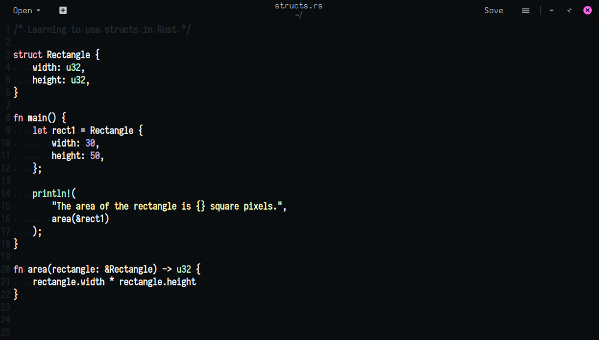

# SAGA for Gedit

A dark theme for [Gedit](https://wiki.gnome.org/Apps/Gedit).

## Installation
- `git clone https://github.com/SAGAtheme/Gedit $HOME/.local/share/gedit/styles`
- Activate in Gedit's preference dialog

## License

[MIT License](./LICENSE)
