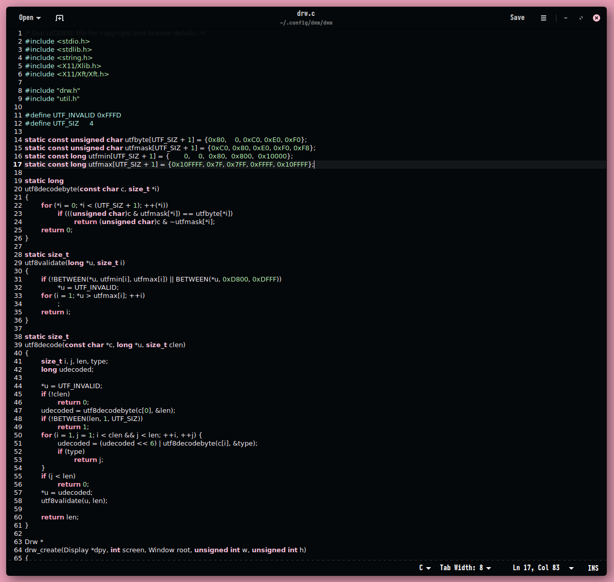

# SAGA for Gedit

A dark theme for [Gedit](https://wiki.gnome.org/Apps/Gedit).

## Installation
Download the raw file:

`wget https://raw.githubusercontent.com/SAGAtheme/gedit/master/SAGA.xml`

Move the file to gedit styles folder:

`mv SAGA.xml $HOME/.local/share/gedit/styles/`

Activate in Gedit's preference dialog

## License

[MIT License](./LICENSE)
